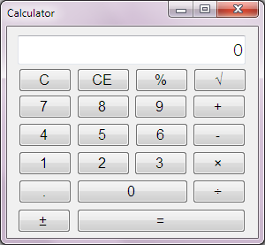
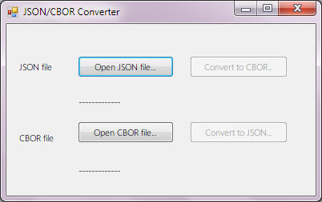

Calculator
====

**Download source code: [ZIP file](https://github.com/peteroupc/Calculator/archive/master.zip)**

If you like this software, consider donating to me at this link: [http://upokecenter.dreamhosters.com/articles/donate-now-2/](http://upokecenter.dreamhosters.com/articles/donate-now-2/)

----

This package contains two demo programs:

* A calculator for .NET, intended to demonstrate the arbitrary-precision arithmetic
capabilities of the CBOR library.
* A converter from JSON to CBOR and back, intended to demonstrate the CBOR
and JSON features of the CBOR library.

To compile this package, you first need to install the package "PeterO.Cbor" from the NuGet repository.

Source Code
---------
Source code is available in the [project page](https://github.com/peteroupc/Calculator).

About
-----------

Written by Peter O.

Any copyright is dedicated to the Public Domain.
[http://creativecommons.org/publicdomain/zero/1.0/](http://creativecommons.org/publicdomain/zero/1.0/)

If you like this, you should donate to Peter O.
at: [http://upokecenter.dreamhosters.com/articles/donate-now-2/](http://upokecenter.dreamhosters.com/articles/donate-now-2/)
